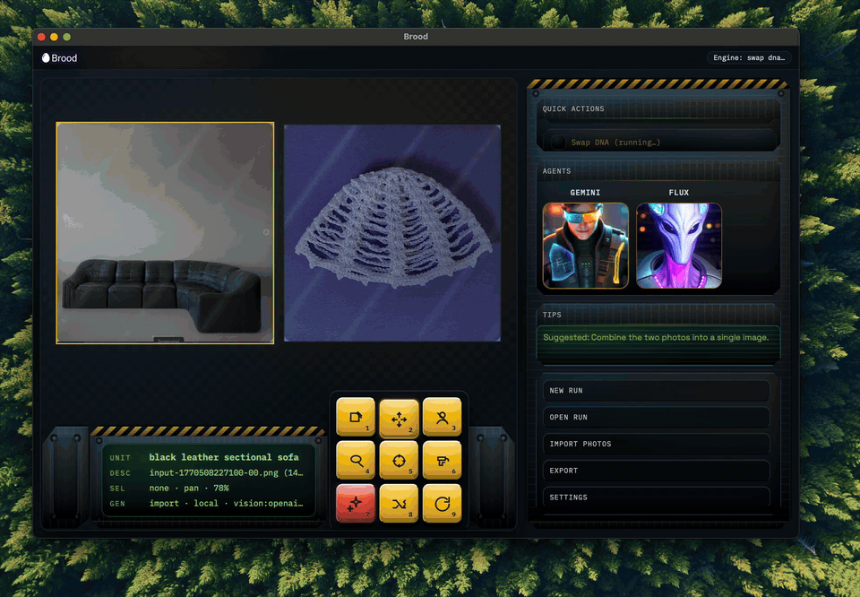

# Brood

Brood is an image-first desktop canvas for steering AI image edits and generations using reference images.

## Status

Brood is currently a **macOS-only Desktop app** (Tauri). There is no web app, and Windows/Linux builds are not supported yet.

<p align="left">
  
</p>

- 1 image in: `Diagnose` (creative-direction critique), `Recast` (reimagine in a new medium/context)
- 2 images in: `Combine`, `Swap DNA`, `Bridge`, `Argue`
- Provider/model switching is a first-class concept (OpenAI, Gemini, Imagen, Flux, SDXL)

## Quickstart (desktop)

```bash
./scripts/dev_desktop.sh
```

This runs the Tauri app in dev mode (`desktop/`) and will spawn the Python engine in the background.

## Desktop usage
- Click **Import Photos** (or drag files onto the canvas).
- Use **Abilities** in the right panel.
- Use `Multi view` to run 2-photo actions (when exactly 2 photos are loaded). After a 2-photo action completes, Brood switches back to single-image view (output-only).
- `Diagnose` / `Argue` output appears in the bottom HUD as `DIAG` / `ARG`.
- Hotkeys: `L` lasso, `D` designate, `F` fit-to-view, `Esc` clears selection, `1`-`9` activate tools in the HUD keybar

More details: `docs/desktop.md`.

## Quickstart (engine / CLI)

The engine/CLI is primarily a developer interface that powers the desktop app.

```bash
python -m venv .venv
source .venv/bin/activate
pip install -e .[dev]

# Chat loop
brood chat --out /tmp/brood-run --events /tmp/brood-run/events.jsonl

# Single run
brood run --prompt "hero image for Series A" --out /tmp/brood-run

# Recreate flow
brood recreate --reference path/to/image.png --out /tmp/brood-recreate
```

## Desktop build

```bash
cd desktop
npm install
npm run tauri build
```

## Memory

Enable local memory:

```bash
export BROOD_MEMORY=1
```

## Pricing overrides

Edit `~/.brood/pricing_overrides.json` to override pricing or latency values.

## API keys
- Copy `.env.example` to `.env` and fill in provider keys.
- Supported keys mirror Param Forge: OpenAI, Anthropic, Gemini/Google, Imagen/Vertex, Flux/BFL.
- For OpenAI images, set `OPENAI_API_KEY` (or `OPENAI_API_KEY_BACKUP`).
  Use `/image_model gpt-image-1` in chat or `--image-model gpt-image-1` on the CLI to target OpenAI image models.
  Optional toggles: `OPENAI_IMAGE_USE_RESPONSES=1` (Responses API) and `OPENAI_IMAGE_STREAM=1` (streaming; falls back to non-streaming with a warning).

## Troubleshooting (Desktop)
- **App failed to initialize: Importing binding name ... not found**  
  Ensure Tauri v1 APIs are used. This repo expects `@tauri-apps/api` v1 and the v1 CLI.
- **Images not rendering**  
  Tauri must allow file access under `$HOME/**` (see `desktop/src-tauri/tauri.conf.json`).
- **Import Photos fails or does nothing**  
  The selected files must be within the allowed FS scope (default: `$HOME/**`). Adjust the scope in `desktop/src-tauri/tauri.conf.json` if needed.

## Project layout

- `brood_engine/` core engine and CLI
- `desktop/` Tauri desktop app
- `tests/` pytest suite
- `docs/param_forge_reference.md` Param Forge reference notes
- `docs/desktop.md` Desktop UI notes (abilities + workflows)

## Agent/LLM entrypoints

- `llms.txt` high-signal entrypoints and task routing for LLM agents.
- `agent-intake.json` optional Agent Intake Protocol (AIP) contract (curated entrypoints + optional context packs).
- `scripts/aip_build_packs.py` builds JSON context packs to host and return via AIP (writes to `outputs/aip_packs/`, gitignored).
- `scripts/aip_server.py` stdlib-only local stub AIP server for testing the contract + pack downloads.
