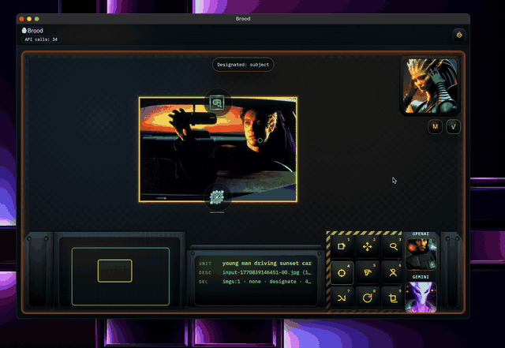
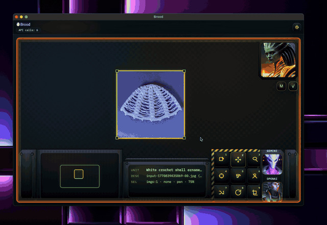
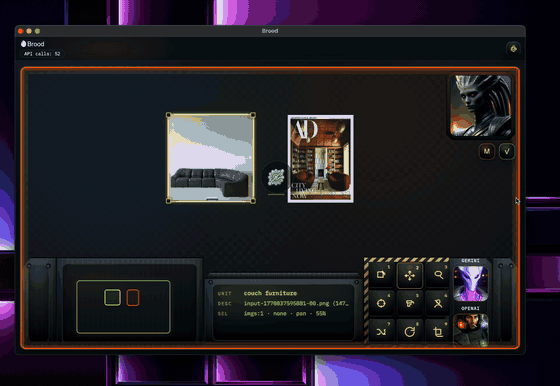

# Brood: Reference-First AI Image Editing Desktop for Developers

<p align="left">
  
</p>

Brood is a promptless, reference-first AI image generation and editing desktop for developers.
You steer outputs by arranging and combining images on a canvas, then applying abilities.

## Status

Brood is currently a **macOS-only desktop app** (Tauri).
There is no web app, and Windows/Linux builds are not supported yet.

## Download (macOS)

Get the latest universal DMG from GitHub Releases:
- <https://github.com/kevinshowkat/brood/releases>

Install:
1. Download `Brood_<version>_universal.dmg`.
2. Open the DMG and drag `Brood.app` into `/Applications`.
3. If macOS blocks launch, right-click `Brood.app` and choose **Open**.

## What You Can Do

- 1 image: `Diagnose`, `Recast`
- 2 images: `Combine`, `Swap DNA`, `Bridge`, `Argue`
- Multi-view effect tokens: `Extract DNA`, `Soul Leech`
- Multi-provider model support: OpenAI, Gemini, Imagen, Flux, SDXL

## First 5 Minutes (Desktop)

1. Import one or more images (click canvas or use **Import Photos**).
2. Use **Abilities** to run an operation.
3. For transfer workflows, use `Extract DNA` / `Soul Leech`, then drag the token to another image.
4. Watch bottom HUD output for `DIAG` / `ARG` messages.

Notes:
- Two-image actions return to output-only single view when complete.
- Adding more images switches back to multi view when needed.

More usage details: `docs/desktop.md`.

## Mother Context Packets

Brood now ships compact context packets for both proposal inference and Gemini generation:
- `brood.mother.proposal_context.v1` (intent/proposal soft priors)
- `brood.gemini.context_packet.v2` (generation-time proposal lock + spatial hints)

Details and scoring math:
- `docs/desktop.md#mother-proposal--gemini-context-v2`

## Features

### Remove People
Remove unwanted people from a photo with a fast, local canvas workflow.
<p align="left">
  
</p>

### Edit Annotation
Constrain edits to a selected region so changes stay focused and controllable.
<p align="left">
  
</p>

### Intent Build
Work in progress: Mother runs ambient intent discovery as you build to support Intent Build outputs.
<p align="left">
  
</p>

## Hotkeys

- `L` lasso
- `D` designate
- `F` fit-to-view
- `Esc` clear selection
- `1`-`9` activate HUD tools

## Run From Source (Desktop)

```bash
./scripts/dev_desktop.sh
```

This runs the Tauri app in dev mode (`desktop/`) and spawns the Python engine in the background.

Build desktop app:

```bash
cd desktop
npm install
npm run tauri build
```

## Engine / CLI Quickstart

The engine CLI powers the desktop app and can also run standalone.

```bash
python -m venv .venv
source .venv/bin/activate
pip install -e .[dev]

# Chat loop
brood chat --out /tmp/brood-run --events /tmp/brood-run/events.jsonl

# Single run
brood run --prompt "hero image for Series A" --out /tmp/brood-run

# Recreate flow
brood recreate --reference path/to/image.png --out /tmp/brood-recreate
```

## API Keys

- Copy `.env.example` to `.env` and fill provider keys.
- Supported key families: OpenAI, Anthropic, Gemini/Google, Imagen/Vertex, Flux/BFL.
- For OpenAI image models:
  - set `OPENAI_API_KEY` (or `OPENAI_API_KEY_BACKUP`)
  - use `/image_model gpt-image-1` in chat or `--image-model gpt-image-1` on CLI
  - optional: `OPENAI_IMAGE_USE_RESPONSES=1`, `OPENAI_IMAGE_STREAM=1`

## Optional Configuration

Enable local memory:

```bash
export BROOD_MEMORY=1
```

Pricing/latency override file:

- `~/.brood/pricing_overrides.json`

## Troubleshooting (Desktop)

- **App failed to initialize: Importing binding name ... not found**  
  Repo expects Tauri v1 APIs (`@tauri-apps/api` v1 and v1 CLI).
- **Images not rendering**  
  Tauri must allow file access under `$HOME/**` (see `desktop/src-tauri/tauri.conf.json`).
- **Import Photos fails or does nothing**  
  Selected files must be inside allowed FS scope (`$HOME/**` by default).

## Project Layout

- `brood_engine/` core engine and CLI
- `desktop/` Tauri desktop app
- `tests/` pytest suite
- `docs/param_forge_reference.md` Param Forge reference notes
- `docs/desktop.md` desktop UI notes (abilities + workflows)

## Agent / LLM Entrypoints

- `llms.txt` high-signal entrypoints and task routing
- `llms-full.txt` expanded inlined context (`python3 scripts/build_llms_full.py`)
- `agent-intake.json` optional Agent Intake Protocol (AIP) contract
- `scripts/aip_build_packs.py` build JSON context packs to `outputs/aip_packs/`
- `scripts/aip_server.py` stdlib-only local AIP stub server

## License

Apache License 2.0. See `LICENSE`.
