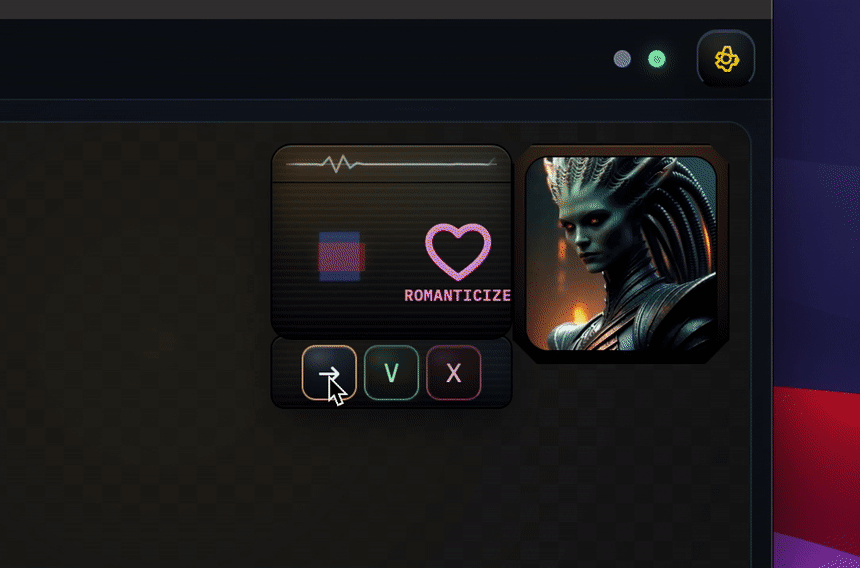
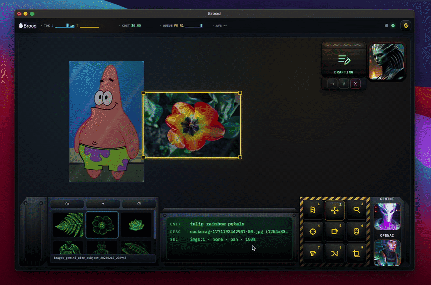
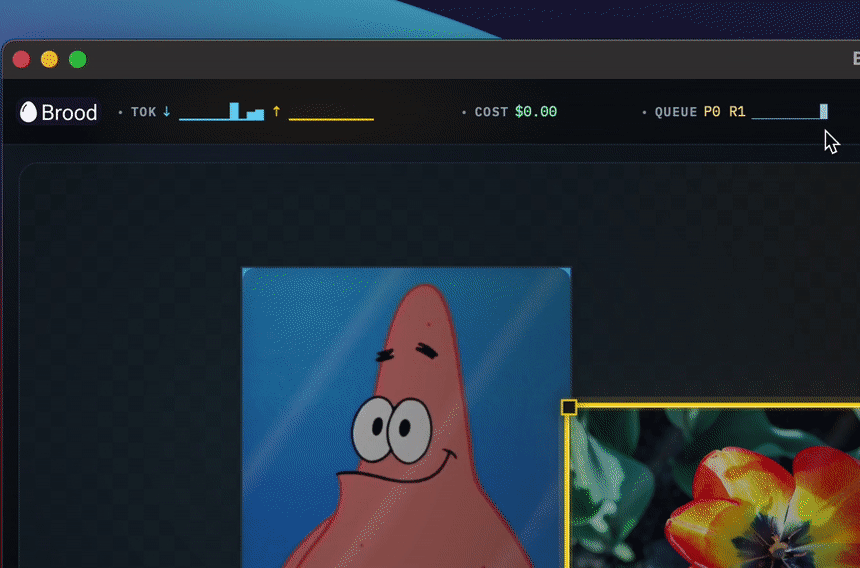

# Brood: Reference-First AI Image Editing for macOS

<p align="left">
  
</p>

Brood helps developers turn existing images into new high-quality variants without prompt writing, while keeping every run reproducible on their Mac.

## How to set up in 5m

- Install the latest macOS app from Releases, open it, and complete the in-app OpenRouter onboarding.
- Import one or more images to the canvas and arrange/resize them to communicate intent.
- Let Mother propose the next edit, then confirm, reject, or reroll from the same canvas loop.

## Key docs

- Desktop product + workflows: `docs/desktop.md`
- Reference-first workflow overview: `docs/reference-first-image-editing.md`
- Local/private model and run data model: `docs/macos-local-private-image-editing.md`
- Benchmarking and repeatability playbook: `docs/benchmark-playbook.md`
- Capability-to-outcome matrix: `docs/why-brood-matrix.md`
- Docs index: `docs/README.md`
- Agent/dev entrypoints: `llms.txt`

## Highlights

### 1) Realtime Canvas Proposals
Mother watches your on-canvas edits and proposes the next best transformation without requiring typed prompts.

<p align="left">
  <a href="media/features/readme/realtime_canvas_proposals.gif">
    
  </a>
</p>

### 2) Proposal Drafting and Fast Accept/Deploy Loop
Mother drafts a concrete proposal, then you can accept and deploy in-place with deterministic run artifacts.

<p align="left">
  <a href="media/features/readme/proposal_drafting.gif">
    
  </a>
</p>

### 3) Live Cost/Token/Queue Telemetry While You Work
Top-panel telemetry keeps model usage, latency, queue depth, and cost visible as you iterate.

<p align="left">
  <a href="media/features/readme/top_panel_telemetry.gif">
    
  </a>
</p>

## Roadmap

- Reduce time-to-first-draft by parallelizing more of Mother's compile + generate path and trimming avoidable queue waits.
- Expand multi-image operation specs and effect-token workflows to make complex edits more controllable.
- Increase provider parity and release hardening while keeping artifacts and receipts stable and reproducible.

## Status

Brood is currently a **macOS-only desktop app** (Tauri). There is no web app, and Windows/Linux builds are not supported yet.

## Download (macOS)

Get the latest universal DMG from GitHub Releases:
- <https://github.com/kevinshowkat/brood/releases>

Install:
1. Download `Brood_<version>_universal.dmg`.
2. Open the DMG and drag `Brood.app` into `/Applications`.
3. If macOS blocks launch, right-click `Brood.app` and choose **Open**.

## Run from source

```bash
./scripts/dev_desktop.sh
```

Build desktop app:

```bash
cd desktop
npm install
npm run tauri build
```

## Local-first run artifacts

Each run writes artifacts under `~/brood_runs/run-*` (for example: `events.jsonl`, `mother_trace.jsonl`, generation payloads, and receipts).

## License

Apache License 2.0. See `LICENSE`.
