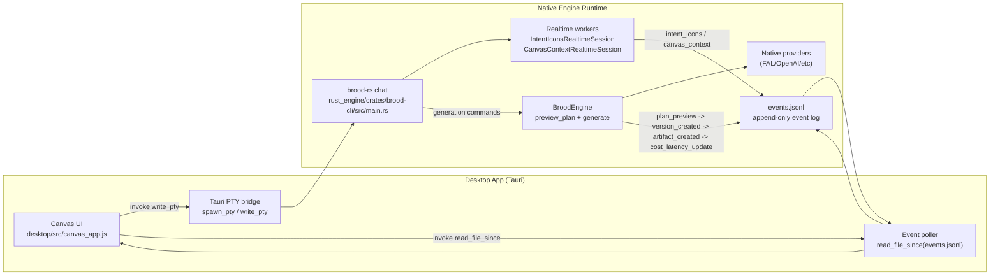
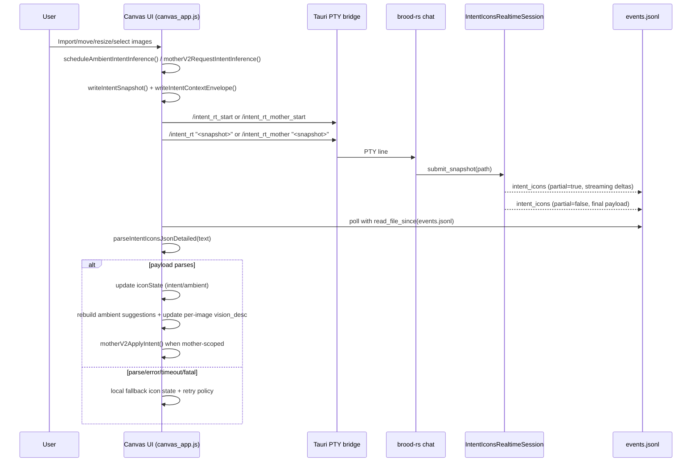
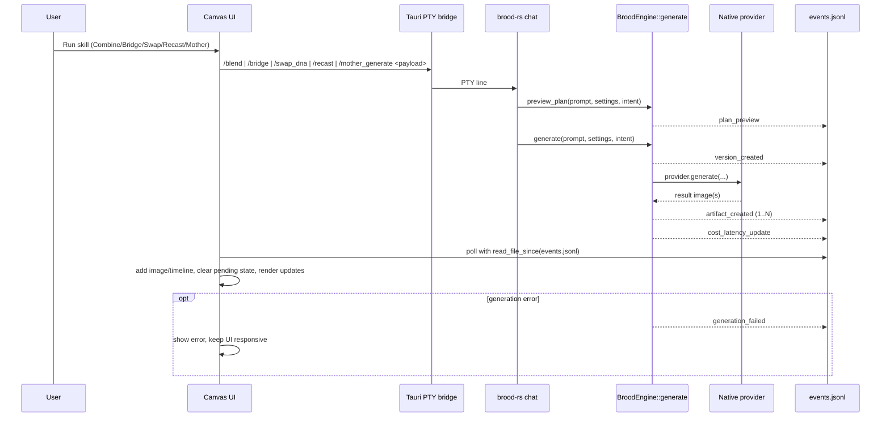

# Realtime Canvas, Intent Proposal, and Generation Flow

This diagram shows how the desktop canvas talks to realtime intent proposal and how accepted actions flow into native generation.

## Components

SVG: `docs/assets/diagrams/realtime_canvas_intent_generation_flow/components.svg`  
PNG: `docs/assets/diagrams/realtime_canvas_intent_generation_flow/components.png`  
Source: `docs/assets/diagrams/realtime_canvas_intent_generation_flow/src/components.mmd`

## Realtime Intent Loop (Ambient + Mother)

SVG: `docs/assets/diagrams/realtime_canvas_intent_generation_flow/realtime_intent_loop.svg`  
PNG: `docs/assets/diagrams/realtime_canvas_intent_generation_flow/realtime_intent_loop.png`  
Source: `docs/assets/diagrams/realtime_canvas_intent_generation_flow/src/realtime_intent_loop.mmd`

## Generation Loop (Action Grid or Mother Dispatch)

SVG: `docs/assets/diagrams/realtime_canvas_intent_generation_flow/generation_loop.svg`  
PNG: `docs/assets/diagrams/realtime_canvas_intent_generation_flow/generation_loop.png`  
Source: `docs/assets/diagrams/realtime_canvas_intent_generation_flow/src/generation_loop.mmd`

## PTY Command and Event Map

| PTY command | Primary emitted events |
| --- | --- |
| `/intent_rt` | `intent_icons`, `intent_icons_failed` |
| `/intent_rt_mother` | `intent_icons`, `intent_icons_failed` (mother-scoped) |
| `/canvas_context_rt` | `canvas_context`, `canvas_context_failed` |
| `/mother_generate`, `/blend`, `/bridge`, `/swap_dna`, `/recast`, `/triforce` | `plan_preview`, `version_created`, `artifact_created`, `cost_latency_update` (or `generation_failed`) |

## Ordering Contract

For successful generation flows, event order must stay:

1. `plan_preview`
2. `version_created`
3. `artifact_created`
4. `cost_latency_update`

This order is emitted in `rust_engine/crates/brood-engine/src/lib.rs` and covered by engine tests in the same file.
