# Realtime Canvas Overview

This page is a short visual summary of the realtime canvas flow.

## Main diagram

Files:
- `docs/assets/diagrams/realtime_canvas_user_benefits_story/one_slide_overview.svg`
- `docs/assets/diagrams/realtime_canvas_user_benefits_story/one_slide_overview.png`
- `docs/assets/diagrams/realtime_canvas_user_benefits_story/one_slide_overview_16x9.png`

## Short version

1. The user changes the canvas.
2. Brood reads the visible image layout and recent actions.
3. Brood suggests a next step and can generate from that context.
4. The run saves outputs, receipts, and events.

## Related diagrams

