# Realtime Canvas: User Benefit Narrative

This is the product story for why Brood's realtime canvas context system is a better user experience than a stateless prompt-only workflow.

## One-line Product Promise

Brood understands your canvas as you work, so you spend less time re-explaining and more time shipping strong visual outcomes.

## What Users Feel

1. Faster starts: users can move images and run skills without writing long setup prompts.
2. Better first drafts: generated outputs preserve subject identity, composition, and style cues from the actual canvas.
3. Lower frustration: fewer "that's not what I meant" retries because intent is grounded in real interaction and layout context.
4. More confidence: every generation is traceable through ordered events, receipts, and timeline artifacts.

## Value Chain

SVG: `docs/assets/diagrams/realtime_canvas_user_benefits_story/value_chain.svg`  
PNG: `docs/assets/diagrams/realtime_canvas_user_benefits_story/value_chain.png`  
Source: `docs/assets/diagrams/realtime_canvas_user_benefits_story/src/value_chain.mmd`

## Context We Capture and How We Use It

| Context captured | Where it comes from | How we use it | User-visible benefit |
| --- | --- | --- | --- |
| Spatial scene state (position, scale, overlap, layout) | Canvas geometry + selection state | Builds proposal context and model envelopes for composition-aware generation | Outputs match layout intent instead of random composition drift |
| Interaction intent signals (move/resize/selection/action hits + recency) | Realtime interaction stream | Weighs salience and role assignment (what matters most right now) | Edits feel responsive to what the user just did |
| Vision summaries per image (short realtime descriptions) | Realtime vision + fallback describe | Grounds intent inference and role mapping with semantic labels | Multi-image transforms preserve the right elements |
| Structured intent proposals (branches, confidence, transformation mode) | Realtime intent worker + parser | Drives Mother suggestions and ambient skill recommendations | Better suggestions with fewer manual prompt rewrites |
| Generation telemetry (plan/model/version/artifact/cost/latency) | Engine events.jsonl + receipts | Powers reliability UX, benchmarking, and reproducibility | Users can trust outcomes and debug failures quickly |

## User Benefit Flywheel

SVG: `docs/assets/diagrams/realtime_canvas_user_benefits_story/benefit_flywheel.svg`  
PNG: `docs/assets/diagrams/realtime_canvas_user_benefits_story/benefit_flywheel.png`  
Source: `docs/assets/diagrams/realtime_canvas_user_benefits_story/src/benefit_flywheel.mmd`

## Before vs After (What Changes for a Typical User)

| Moment | Stateless prompt workflow | Brood realtime context workflow |
| --- | --- | --- |
| Importing references | User must type all scene details manually | Canvas already provides spatial + semantic context |
| Asking for an edit | Prompt guesswork and repeated clarifications | Intent proposal is grounded in live canvas evidence |
| Evaluating output | Hard to tell why result missed | Timeline + events + receipts explain what happened |
| Iterating | More trial-and-error prompt churn | Faster convergence with role-aware follow-ups |

## What to Measure (Product KPIs)

1. Time to first accepted output (TTFA): should decrease.
2. First-pass acceptance rate: should increase.
3. Manual prompt length per successful run: should decrease.
4. Retry count per accepted output: should decrease.
5. Per-output trust/reproducibility (receipt + event completeness): should stay at 100%.

## Why This Is a Defensible UX Advantage

1. Context capture is continuous, not one-shot.
2. Decisioning is explicit (intent + role + model envelope), not opaque prompt magic.
3. Execution is auditable (event ordering + artifacts + receipts), not black-box only.
4. Learning loop exists (benchmarks and telemetry), so quality can improve without changing user effort.
